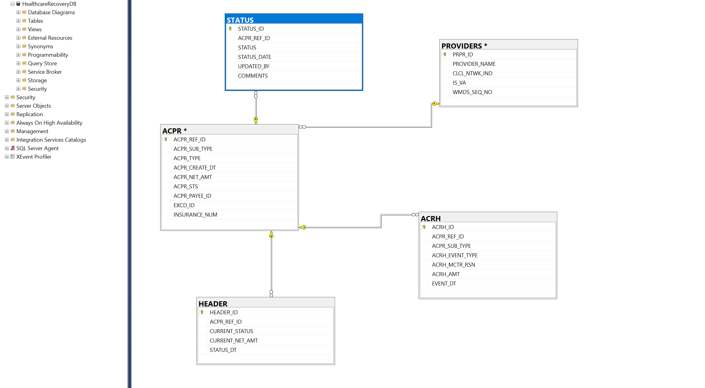

# 🏥 Healthcare Claims Recovery SQL Project

This project simulates a real-world healthcare claims recovery system designed to track overpayments, generate collection letters, log audit events, and automate small-balance write-offs using SQL Server. It demonstrates strong SQL development practices with schema design, stored procedures, views, and sample data integration.

---

## 📌 Project Summary

Healthcare payers often need to recover funds from providers due to overpayments or manual adjustments. This system manages:

- Tracking overpayment claims
- Generating collection letters based on business rules
- Logging status changes and audit events (e.g., HOLD, WRITE-OFF)
- Automatically writing off small, aged recoveries
- Power BI reporting readiness via well-structured views

---

## 🧱 Schema Overview

| Table        | Description |
|--------------|-------------|
| `ACPR`       | Main recovery claims table |
| `PROVIDERS`  | Provider lookup with PAR, NON-PAR, and VA flags |
| `HEADER`     | Real-time snapshot of recovery status and balance |
| `STATUS`     | Full audit trail of recovery status history |
| `ACRH`       | Event log for HOLD, SWOF (write-off), and other triggers |

---

## 🗺️ Database Diagram

The diagram below shows how all five core tables relate to each other via foreign keys. `ACPR` acts as the central claims table connected to `PROVIDERS`, `STATUS`, `HEADER`, and `ACRH`.

---

#⚙️ SQL Scripts

### ✅ Schema & Data
- `create_tables.sql`: Defines all five tables with appropriate constraints and foreign keys
- `insert_sample_data_bulk.sql`: Inserts 10 sample records per table for testing (bulk format)

### ✅ Stored Procedures & Triggers
- `usp_GenerateEligibleLetters.sql`: Automates collection letter generation for eligible recoveries based on amount, aging, and exclusion conditions.
- `usp_WriteOffSmallClaims.sql`: Identifies aged and low-value claims, logs a write-off event, updates balance, and inserts a 'WRITE-OFF' status automatically.
- `tr_AutoStatusOnZeroBalance.sql`: Trigger that fires after an update on the `ACPR` table. If a recovery's `ACPR_NET_AMT` is updated to `0`, it automatically inserts a `'CLOSED'` status into the `STATUS` table. This replicates real-world automation when a recovery is fully paid or written off.

### ✅ Views
- `vw_CurrentRecoverySnapshot.sql`: Combines recovery and provider data for live status reporting
- `vw_RecoveryStatusHistory.sql`: Tracks all status changes across the claim lifecycle
- `vw_WriteOffSummary.sql`: Summarizes write-offs by amount, provider, and network type
- `vw_RecoveryAgingDetail.sql`: Tracks how overdue each recovery is for escalation

---

## 📊 Power BI Dashboard

This project includes a Power BI dashboard to visualize recovery claims, provider distribution, and claim statuses.

📄 Full Version

[📥 Download the Power BI Dashboard PDF](power_bi/Healthcare_Claims_Recovery_Dashboard_PrakashPyakurel.pdf.pdf)

---

## 💡 Use Cases

- Recruiters and hiring managers can run this in SQL Server to see your practical SQL skills
- Data analysts can connect Power BI directly to the views for visual reporting
- Interviewers can test your ability to work with business logic, audit trails, and automation in SQL

---

## 🛠️ How to Run This Project

1. Open `create_tables.sql` in SSMS and execute to create the schema
2. Run `insert_sample_data_bulk.sql` to populate tables with test data
3. Execute both stored procedures to simulate business operations
4. Execute the trigger file to activate automatic closure logic
5. Use the views for reporting or connect to Power BI

---

## ✅ Author

**Prakash Pyakurel**  
[LinkedIn](https://www.linkedin.com/in/prakashpyakurel/) | [GitHub](https://github.com/prakash-pyakurel)
